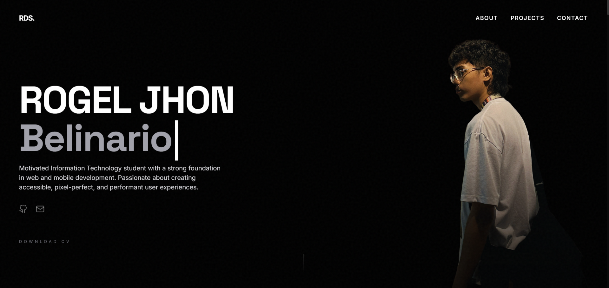

# 🎨 Rogel's Portfolio

> A modern, minimalist portfolio showcasing web development projects and IoT solutions with stunning animations, 3D experiences, and a seamless user interface.

[](https://rodjdevsec.vercel.app)



---

## 📋 About This Portfolio

This is a **fully responsive digital portfolio** built to highlight my journey as an **Information Technology student** and **full-stack developer**. It showcases projects ranging from **IoT systems** to **modern web applications** with a focus on immersive user experiences.

### Key Features:
- 🌟 **Premium Design** - Dark mode aesthetic with glassmorphism and smooth animations.
- 🧊 **3D Gallery** - An immersive 3D photo gallery built with **Three.js** and gyroscope support for mobile.
- 🎙️ **Voice Message** - Interactive voice introduction on the About page.
- ⚡ **Performance Optimized** - Fast loading with optimized assets and clean architecture.
- 📱 **Fully Responsive** - Tailored experience for both desktop and mobile users.
- 🎭 **Interactive UI** - Engaging animations powered by **GSAP** and **ScrollTrigger**.
- 🎯 **Modern Stack** - Minimalist and maintainable codebase.

---

## 🛠️ Tech Stack

### Languages & Frameworks


### Libraries & 3D


### Security & Deployment


---

## 📁 Project Structure

```
portfolio/
├── api/                   # Serverless functions (Vercel Backend)
│   └── send-message.js    # Secure form submission & Turnstile verification
├── assets/                # Media & static assets
│   ├── cert/              # Certification images
│   ├── dlh/               # DLH project assets
│   ├── img/               # UI icons, backgrounds & assets (e.g. preview.png, hero-bg.png)
│   ├── poultryfi/          # Poultry-Fi project assets
│   ├── travouge/          # Travouge project assets
│   ├── whereintapat/      # WhereInTapat project assets
│   ├── vm.m4a             # Voice Message audio file
│   └── Rogel Jhon A Belinario - Resume.pdf
├── css/                   # Styling
│   └── styles.css         # Custom styles & Tailwind utilities
├── js/                    # JavaScript modules
│   ├── animations.js      # GSAP & ScrollTrigger logic
│   ├── config.js          # App configuration
│   ├── data.js            # Project & certificate data
│   ├── events.js          # UI event handlers
│   ├── main.js            # Application entry & routing
│   └── ui.js              # UI component logic (Modals, Nav)
├── index.html             # Landing page / Home
├── about.html             # About me, Experience & Education
├── gallery.html           # 3D Immersive Photo Gallery
├── projects.html          # Detailed projects collection (Live Preview)
├── certificates.html      # Professional certifications gallery
├── contactform.html       # Interactive contact page with Turnstile
├── thankyou.html          # Form submission confirmation page
├── vercel.json            # Deployment & routing configuration (Clean URLs)
└── README.md              # Project documentation
```

## 📦 Installation & Setup

```bash
# Clone the repository
git clone https://github.com/rodjdevsec/portfolio.git

# Navigate to the project directory
cd portfolio

# Use Vercel CLI for local development with API support
vercel dev
```

---

<div align="center">

### ⭐ Star this repo if you found it helpful!

**Made with ❤️ by Rogel Jhon Belinario**

*© 2026 Rogel Jhon. All rights reserved.*

</div>
